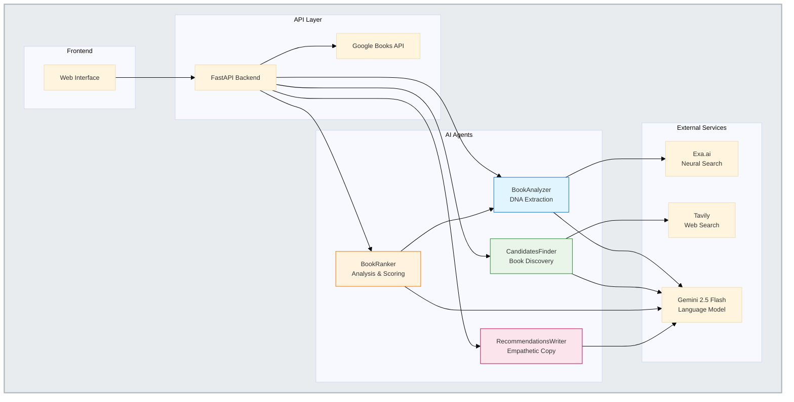

# Technical Architecture Diagram

## Description

This diagram shows the technical architecture of the Librarian system:

### Frontend Layer
- **Web Interface**: Server-rendered HTML with Jinja2 templates and vanilla JavaScript

### API Layer  
- **FastAPI Backend**: Main application server handling all requests
- **Google Books API**: External service for seed book metadata

### AI Agents Layer
- **BookAnalyzer**: Extracts DNA pillars from books using web research
- **CandidatesFinder**: Discovers similar books based on user preferences  
- **BookRanker**: Analyzes and ranks candidate books with confidence scores
- **RecommendationsWriter**: Generates empathetic user-facing copy

### External Services Layer
- **Exa.ai**: Neural search engine for book analysis research
- **Tavily**: Advanced web search for candidate discovery
- **Gemini 2.5 Flash**: Language model powering all AI agents

### Data Flow
1. User interactions flow from Web Interface to FastAPI Backend
2. Backend orchestrates AI agents based on user requests
3. Each agent uses appropriate external services for their specialized tasks
4. All agents leverage Gemini 2.5 Flash for language understanding and generation