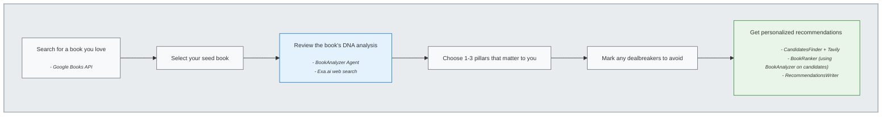

# User Journey Flow Diagram

## Description

This diagram shows the complete user journey through the Librarian system:

1. **Search Phase**: User searches for a book they love using Google Books API
2. **Selection Phase**: User selects their seed book from search results
3. **Analysis Phase**: BookAnalyzer agent extracts the book's DNA using Exa.ai web search
4. **Preference Phase**: User chooses 1-3 DNA pillars that matter most to them
5. **Filtering Phase**: User marks any dealbreakers to avoid in recommendations
6. **Recommendation Phase**: Multi-agent pipeline generates personalized recommendations using CandidatesFinder, BookRanker, and RecommendationsWriter agents