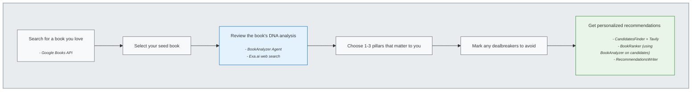
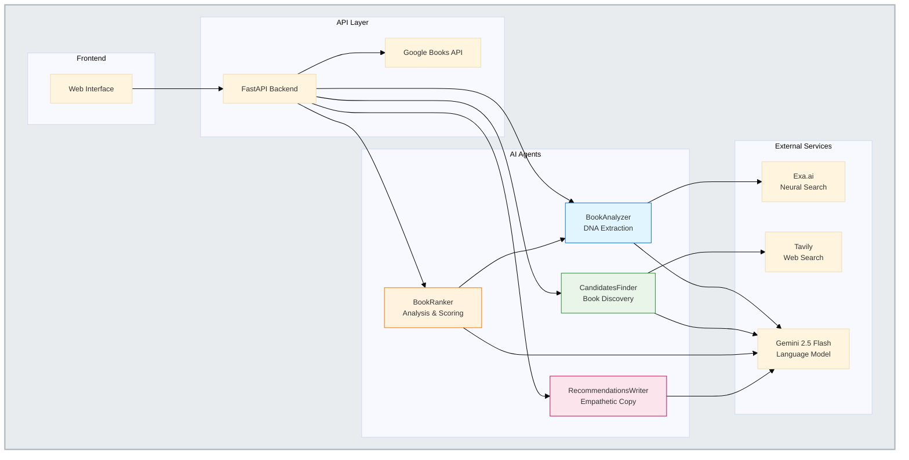

# Design Document

## Overview

The Librarian is a sophisticated AI-powered book recommendation system that uses multiple specialized agents to analyze books, find candidates, rank them, and generate empathetic recommendations. The system deconstructs books into "DNA Pillars," allows users to select their preferences, and discovers fresh recommendations that match their vibe while offering new experiences.

## System Architecture Diagrams

### User Journey Flow



### Technical Architecture




## Architecture

### System Flow
1. **Book Search & Selection:** User searches for and selects a seed book using Google Books API
2. **DNA Analysis:** BookAnalyzer agent researches the seed book and extracts 6 DNA pillars
3. **User Preference Selection:** User selects 1-3 DNA pillars to prioritize and marks dealbreakers
4. **Candidate Discovery:** CandidatesFinder agent searches the web for 5 similar books
5. **Candidate Analysis & Ranking:** BookRanker agent analyzes each candidate and ranks them with confidence scores
6. **Empathetic Copy Generation:** RecommendationsWriter agent transforms technical analysis into user-friendly recommendations
7. **Final Presentation:** Up to 3 recommendations displayed with "Why It Matches" and "What Is Fresh" explanations

### Agent Architecture

The system uses 4 specialized Strands agents, each with external prompt files and specific responsibilities:

| Agent | Purpose | Tools | Model | Key Features |
|-------|---------|-------|-------|--------------|
| **BookAnalyzer** | Extract DNA from any book | Exa.ai web search | Gemini 2.5 Flash | Parallel search processing, 5K char limits |
| **CandidatesFinder** | Find 5 similar books | Tavily web search | Gemini 2.5 Flash | 400-char snippet limits, ranking explanations |
| **BookRanker** | Analyze and rank candidates | BookAnalyzer (internal) | Gemini 2.5 Flash | Sequential analysis, confidence scoring |
| **RecommendationsWriter** | Generate empathetic copy | None | Gemini 2.5 Flash | Transforms technical data to user-friendly text |

### Technical Stack

- **Framework:** Strands Agents with FastAPI backend
- **LLM:** Google Gemini 2.5 Flash for all agents
- **Web Search:** Exa.ai (neural search) and Tavily (advanced search)
- **Frontend:** Server-rendered HTML with Jinja2 templates and vanilla JavaScript
- **Data:** Google Books API for seed book metadata
- **Logging:** Comprehensive colored logging with query/response tracking

## Agent Specifications

### BookAnalyzer Agent

**Responsibility:** Deep analysis of individual books to extract DNA pillars

**Implementation:**
- Uses Exa.ai neural search with parallel processing (ThreadPoolExecutor)
- Searches multiple domains: goodreads.com, reddit.com, literary sites
- 5K character limit per source to manage token usage
- External prompt files: `book_analyzer_system.md`, `book_analyzer_task.md`

**Search Strategy:**
```python
queries = [
    f'"{title}" by {author} book review analysis',
    f'"{title}" {author} literary criticism prose style',
    f'"{title}" {author} reader discussion themes'
]
```

**Output:** BookDNAResponse with 6 pillars + genre + dealbreakers

### CandidatesFinder Agent

**Responsibility:** Find 5 candidate books similar to seed book based on user preferences

**Implementation:**
- Uses Tavily advanced search for comprehensive results
- Single broad search query with LLM post-processing
- 400-character limit on source snippets to prevent token overflow
- External prompt files: `candidates_finder_system.md`, `candidates_finder_task.md`

**Search Strategy:**
```python
query = f'books similar to "{seed_title}" recommendations'
# LLM filters results based on user-selected pillars and dealbreakers
```

**Output:** CandidateList with 5 ranked books and explanations

### BookRanker Agent

**Responsibility:** Analyze candidates and rank them with confidence scores

**Implementation:**
- Uses BookAnalyzer internally to analyze each candidate sequentially
- Skips failed analyses and continues with remaining candidates
- LLM ranks based on DNA comparison and user preferences
- External prompt files: `book_ranker_system.md`, `book_ranker_task.md`

**Ranking Logic:**
- Compares candidate DNA against seed DNA
- Considers user-selected pillars and dealbreakers
- Generates 1-100 confidence scores with detailed reasoning

**Output:** RankingResponse with ranked candidates and analysis metadata

### RecommendationsWriter Agent

**Responsibility:** Transform technical analysis into empathetic user-facing copy

**Implementation:**
- Takes ranking results and generates "Why It Matches" and "What Is Fresh" sections
- Uses external prompt files and candidate summary templates
- Focuses on warm, accessible language without technical jargon
- External prompt files: `recommendations_writer_system.md`, `recommendations_writer_task.md`

**Copy Strategy:**
- **Why It Matches:** Connects book qualities to user preferences
- **What Is Fresh:** Highlights discovery aspects and new experiences
- Maintains encouraging, enthusiastic tone throughout

**Output:** RecommendationResponse with empathetic copy for each book

## Data Models

### Core DNA Structure
```python
class BookDNAResponse(BaseModel):
    book_id: str | None
    title: str
    genre: str
    setting: DNAPillar          # Time, place, atmosphere
    narrative_engine: DNAPillar # Plot/character/concept-driven
    prose_texture: DNAPillar    # Writing style and voice
    emotional_profile: DNAPillar # Dominant emotional resonance
    structural_quirks: DNAPillar # Formal storytelling architecture
    theme: DNAPillar           # Central moral question
    dealbreakers: list[str]    # Elements to avoid

class DNAPillar(BaseModel):
    full_text: str    # Detailed analysis
    summary: str      # 2-3 word summary for UI
```

### Pillar Priority Order
1. **Prose Texture** (highest priority)
2. **Emotional Profile**
3. **Theme**
4. **Setting**
5. **Narrative Engine**
6. **Structural Quirks** (lowest priority)

### Candidate Flow Models
```python
# CandidatesFinder output
class CandidateList(BaseModel):
    candidates: list[CandidateBook]

class CandidateBook(BaseModel):
    title: str
    author: str
    source_snippet: str  # Max 400 chars

# BookRanker output
class RankingResponse(BaseModel):
    candidates: list[RankedCandidate]
    total_analyzed: int
    failed_analyses: int

class RankedCandidate(BaseModel):
    title: str
    author: str
    rank: int
    confidence_score: float  # 0-100
    reasoning: str
    dna: BookDNAResponse | None

# RecommendationsWriter output
class RecommendationResponse(BaseModel):
    recommendations: list[RecommendationCard]
    total_analyzed: int
    failed_analyses: int

class RecommendationCard(BaseModel):
    title: str
    author: str
    rank: int
    confidence_score: float
    why_it_matches: str
    what_is_fresh: str
```

## Frontend Integration

### User Interface Flow
1. **Home Page:** Search box for seed book discovery
2. **Search Results:** Book selection with covers and metadata
3. **DNA Analysis:** Interactive pillar tiles with 1-3 selection limit
4. **Progress Tracking:** Inline progress indicators with timers
5. **Recommendations:** Stacked layout with clickable Google search links

### JavaScript Orchestration
The frontend orchestrates the complete pipeline through API calls:

```javascript
// Step 1: Find candidates
POST /api/books/{book_id}/find-candidates
// Step 2: Rank candidates  
POST /api/books/{book_id}/rank-candidates
// Step 3: Generate recommendations
POST /api/books/{book_id}/recommendations-html
```

### Progress Management
- Non-blocking inline progress indicators
- Timer functionality showing "up to 30 seconds"
- Granular step messaging (Step 1/3, Step 2/3, etc.)
- Automatic scrolling to keep progress visible

## Error Handling & Resilience

### Agent-Level Error Handling
- Structured output validation with fallback responses
- Token limit management through character restrictions
- Graceful degradation when analyses fail
- Comprehensive logging for debugging

### System-Level Resilience
- Continues with partial results when some candidates fail
- Skips failed analyses rather than stopping pipeline
- Provides meaningful error messages to users
- Maintains system state across failures

## Performance Optimizations

### BookAnalyzer Optimizations
- Parallel Exa search processing using ThreadPoolExecutor
- 5K character limit per source (down from 10K)
- Efficient content extraction and processing

### Token Management
- 400-character limits on candidate snippets
- External prompt files for better organization
- Structured output models to prevent verbose responses
- Max output tokens: 8192 (CandidatesFinder), 16384 (BookRanker)

### Logging Strategy
- Colored logging with level prefixes (INFO, ERROR, etc.)
- Query/response tracking for all external services
- Step-by-step progress logging
- Full reasoning visibility for debugging

## Deployment Considerations

### API Dependencies
- Google Books API for seed book metadata
- Exa.ai API for neural web search
- Tavily API for advanced web search  
- Google Gemini API for language model access

### Environment Configuration
- API keys managed through environment variables
- Configurable model parameters (temperature, max_tokens)
- Logging level configuration
- Development vs production settings
