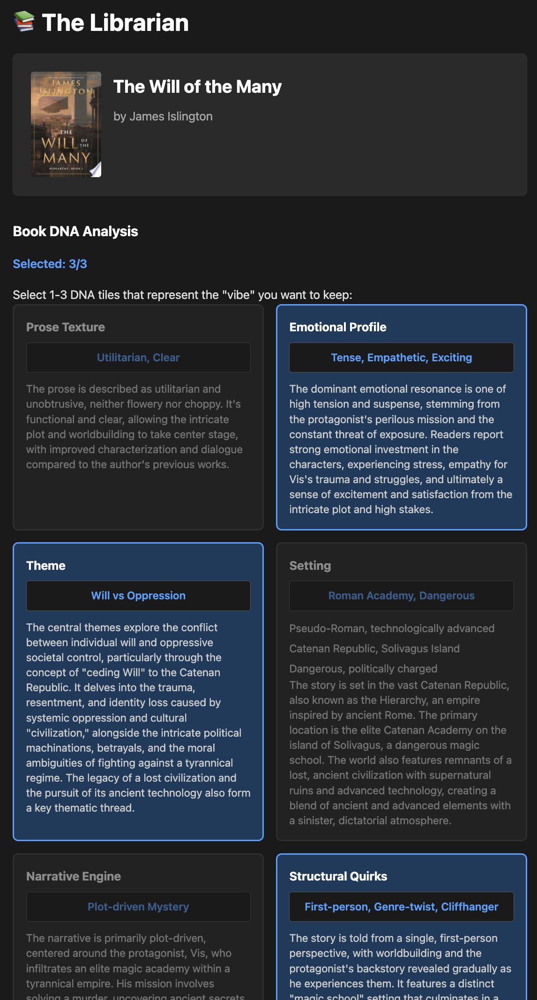
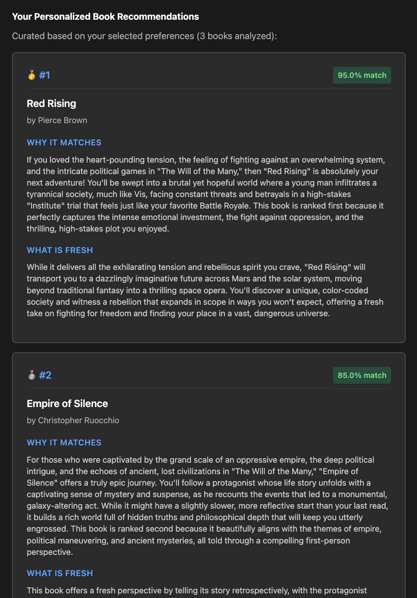

# The Librarian

A vibe-based book discovery engine that delights readers by deconstructing books into their "DNA" to help find perfect recommendations.

## Table of Contents

- [Overview](#overview)
- [Target Users](#target-users)
- [How It Works](#how-it-works)
- [Screenshots](#screenshots)
- [Tech Stack](#tech-stack)
- [Getting Started](#getting-started)
- [Project Structure](#project-structure)
- [API Endpoints](#api-endpoints)
- [Contributing](#contributing)
- [License](#license)

## Overview

Most book recommendation engines rely on "Collaborative Filtering" (People who bought X also bought Y). This often recommends books that are too similar or fails to capture why a reader actually liked a book (e.g., they liked the "sparse, clinical prose," not the sci-fi setting).

The Librarian solves this by being a **Vibe-Based Discovery Engine** that prioritizes "Pivoting" (freshness) over "Cloning" (repetition).

## Target Users

**The Inarticulate Searcher** — a reader who knows how they want to feel but lacks the literary vocabulary to describe it.

## How It Works

1. **Search** - Find a book you loved
2. **Analyze** - AI extracts the book's "DNA" (setting, narrative engine, prose texture, emotional profile, structural quirks, theme)
3. **Discover** - Get LLM-powered recommendations based on the specific elements that made you love the original book
4. **Pivot** - Find books that share your favorite aspects but offer fresh experiences

## Screenshots

**Book DNA Analysis** — AI breaks down a book into its core elements (prose texture, emotional profile, theme, setting, and more) so you can select the "vibes" that matter most to you.



**Personalized Recommendations** — Based on your selected vibes, the engine finds and ranks books that match, explaining why each one fits and what makes it a fresh read.



## Tech Stack

- **Language**: Python
- **Web Framework**: FastAPI
- **Templating**: Jinja2 (server-rendered HTML)
- **Agent Framework**: Strands
- **LLM**: Google Gemini (powers AI analysis, ranking, and recommendation writing)
- **APIs**:
  - Google Books API (book metadata)
  - Exa.ai (web search for book analysis)
  - Tavily (web search for candidate finding)

## Getting Started

### Prerequisites

- Python 3.11+
- Virtual environment

### Installation

1. Clone the repository:
```bash
git clone https://github.com/chienchern/librarian.git
cd librarian
```

2. Create and activate virtual environment:
```bash
python -m venv .venv
source .venv/bin/activate  # On Windows: .venv\Scripts\activate
```

3. Install dependencies:
```bash
pip install -e .
```

4. Set up environment variables:
```bash
# Create a .env file with the following keys:
GOOGLE_BOOKS_API_KEY=your_key_here
GEMINI_API_KEY=your_key_here
EXA_API_KEY=your_key_here
TAVILY_API_KEY=your_key_here
```

5. Run the server:
```bash
python -m uvicorn src.librarian.app:app --reload --host 0.0.0.0 --port 8000
```

6. Open your browser to `http://localhost:8000`

## Project Structure

```
src/librarian/
├── analysis/          # Book DNA analysis agents
├── ranking/           # Candidate finding and ranking
├── seed/              # Book search and metadata
├── writing/           # Recommendation writing
├── shared/            # Common utilities and models
├── templates/         # HTML templates
└── app.py            # FastAPI application
```

## API Endpoints

### Web Pages
- `GET /` - Home page with search
- `GET /search?q=...` - Book search results
- `GET /book/{book_id}/analyze` - Book DNA analysis page with pillar selection

### JSON API
- `GET /api/books/search?q=...` - Search for books
- `GET /api/books/{book_id}` - Get book metadata
- `GET /api/books/{book_id}/analyze` - Analyze book DNA
- `POST /api/books/{book_id}/find-candidates` - Find candidate books
- `POST /api/books/{book_id}/rank-candidates` - Rank candidates with DNA analysis
- `POST /api/books/{book_id}/write-recommendations` - Generate recommendation copy
- `POST /api/books/{book_id}/recommendations-html` - Get recommendations as rendered HTML

## Contributing

This project uses a systematic development approach:

1. **Investigation** - Understand problems step by step
2. **Planning** - Break complex changes into logical steps
3. **Implementation** - Write minimal, focused code
4. **Validation** - Ensure changes work as expected

## License

MIT License